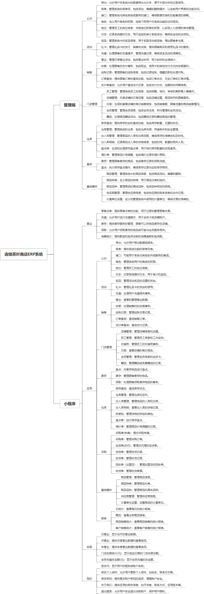

 

    
 

公司拥有上百套具有自主知识产权的软件系统，详情请查看码云首页或公司官网

 
<h1>连锁茶叶商店ERP系统</h1>

<a href="https://www.haishi.net.cn/">公司官网</a> ｜ <a href="https://www.haishi.net.cn/">在线体验</a>

 

## 系统介绍

连锁茶叶商店ERP系统是一个为茶叶连锁企业量身定制的管理软件，提供全面的业务管理解决方案。系统集成了多个模块，包括营业、应用、收银、我的、基础模块等，支持门店管理、库存控制、资金流管理、销售与采购操作，以及各类报表的生成。此外，系统还涵盖了会员管理、公共功能、活动组织、考勤打卡、交班处理等功能，确保门店运营的高效和规范。系统还特别提供了商品管理、供应商管理、资金账户和计量单位设置等细节操作，帮助商家精确控制商品流和资金流。通过这一平台，连锁茶叶店能够实现更好的资源整合，优化日常运营，提高管理效率和客户满意度。
连锁茶叶商店ERP系统是一个为茶叶连锁企业量身定制的管理软件，提供全面的业务管理解决方案。系统集成了多个模块，包括营业、应用、收银、我的、基础模块等，支持门店管理、库存控制、资金流管理、销售与采购操作，以及各类报表的生成。此外，系统还涵盖了会员管理、公共功能、活动组织、考勤打卡、交班处理等功能，确保门店运营的高效和规范。系统还特别提供了商品管理、供应商管理、资金账户和计量单位设置等细节操作，帮助商家精确控制商品流和资金流。通过这一平台，连锁茶叶店能够实现更好的资源整合，优化日常运营，提高管理效率和客户满意度。
本项目名称为连锁茶叶商店ERP系统，是一款面向连锁茶叶商店的企业资源计划管理系统。该系统涵盖了从商品采购、库存管理、销售管理、门店管理到财务管理等多个核心业务环节，旨在帮助茶叶连锁店提升运营效率，降低管理成本，实现精细化运营。
本项目包含小程序端和后台管理系统两个终端：
- 后台管理系统：面向公司内部管理员，提供全面的业务管理功能，包括商品管理、销售管理、门店管理、仓库管理、寄存管理、会员管理、员工管理、报表分析等。
- 小程序端：面向消费者，提供在线点单、充值、寄存、领取等服务，方便顾客进行自助操作。
                

## 系统功能介绍

### 系统包含终端说明

管理端（WEB）、用户端（微信小程序）

| 序号 | 模块 | 模块说明 |
| --- | --- | --- |
| 1 | LS-ERP-CYD-MANAGE | 管理端 |
| 2 | LS-ERP-CYD-MP | 小程序 |
| 3 | LS-ERP-CYD-SERVER | 服务端 |

### 系统功能结构

### 系统功能说明

主要功能：
* 销售管理：涵盖营业、收银、挂账记录、订单查询、支付单查询等功能，实现销售业务的全面管理。
* 门店管理：包括员工管理、店铺管理、日报、会员管理、赠送等功能，支持连锁门店的日常运营管理。
* 仓库管理：提供库存查询、仓库管理、出入库管理、出入库明细、盘点单、调价单等功能，实现对仓库的精细化管理。
* 寄存管理：包括盘点、寄存、领取等功能，方便顾客进行茶叶寄存服务。
* 小程序点单：顾客可以通过小程序进行零售点单、充值、寄存、领取等操作，提升用户体验。
* 会员管理：支持会员注册、积分管理、会员权益设置等，帮助企业进行客户关系管理。
* 库存管理：提供实时的库存查询和出入库管理，确保库存信息的准确性和及时性。

## 系统主要界面

## 系统技术说明

### 代码模块说明

| 序号 | 目录 | 目录说明 |
| --- | --- | --- |
| 1 | LS-ERP-CYD-SERVER/easy-code | -- |
| 2 | LS-ERP-CYD-SERVER/src | -- |

### 系统技术选型

#### 开发语言/框架

JAVA（JDK1.8）
前端框架：uni-app
框架：SpringBoot2.x
系统结构：单体应用

#### 服务中间件

Nginx
Tomcat

#### 数据库

MySQL（5.7+）
Redis

#### 其他说明

无

## 系统演示/商用

请扫码添加客服微信获取演示地址和系统详细资料。

如果您想基于连锁茶叶商店ERP系统进行商业化交付或定制开发服务，我们提供有偿的技术服务支持，合作模式不限，欢迎沟通！

公司官网地址： <a href="https://www.haishi.net.cn/">https://www.haishi.net.cn</a>

联系客服获取专业回答。

## 使用须知

1、 本项目商用必须获得版权所有者的授权。

2、 未经允许本项目代码不允许二次出售。

